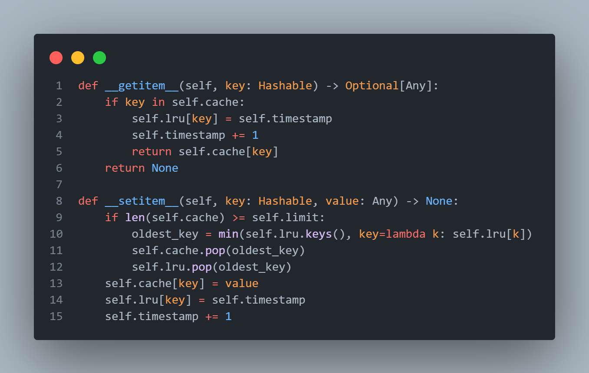

# __Profiling in Python__

## __Execution time profiling__

This experiment utilized naive LRU cache implementation, which envolved linear search for the LRU key.
The most constly operation involved `min` function with `lambda` expression used for key.

```
(deep) sakeof@LAPTOP-VN7C63DA:~/mess/deep-python/hw8$ python cprofile.py
         5998989 function calls in 0.932 seconds

   Random listing order was used

   ncalls  tottime  percall  cumtime  percall filename:lineno(function)
   299940    0.015    0.000    0.015    0.000 {method 'pop' of 'dict' objects}
   149970    0.008    0.000    0.008    0.000 {method 'keys' of 'dict' objects}
        1    0.000    0.000    0.000    0.000 {built-in method builtins.isinstance}
   150000    0.008    0.000    0.008    0.000 {built-in method builtins.len}
   149970    0.368    0.000    0.647    0.000 {built-in method builtins.min}
        1    0.000    0.000    0.000    0.000 /home/sakeof/mess/deep-python/hw8/utils.py:20(tag_factory)
        1    0.000    0.000    0.000    0.000 /home/sakeof/mess/deep-python/hw8/utils.py:5(__init__)
        1    0.000    0.000    0.000    0.000 /home/sakeof/mess/deep-python/hw8/lru.py:5(__init__)
        1    0.000    0.000    0.000    0.000 /home/sakeof/mess/deep-python/hw8/lru.py:12(_validate_input)
   150000    0.018    0.000    0.018    0.000 /home/sakeof/mess/deep-python/hw8/lru.py:17(__getitem__)
  4499100    0.278    0.000    0.278    0.000 /home/sakeof/mess/deep-python/hw8/lru.py:26(<lambda>)
   150000    0.116    0.000    0.794    0.000 /home/sakeof/mess/deep-python/hw8/lru.py:24(__setitem__)
   150001    0.026    0.000    0.026    0.000 cprofile.py:26(<genexpr>)
   150000    0.047    0.000    0.859    0.000 cprofile.py:35(cache_lookup)
   150001    0.009    0.000    0.009    0.000 cprofile.py:30(<genexpr>)
        1    0.038    0.038    0.932    0.932 cprofile.py:13(cache_stress_test)
        1    0.000    0.000    0.000    0.000 {method 'disable' of '_lsprof.Profiler' objects}


(deep) sakeof@LAPTOP-VN7C63DA:~/mess/deep-python/hw8$
```

Let's break down the profiling results:
one may observe that time spent inside `__setitem__` method is split between key accessing and `min` calls.
The latter in turn spends about half of execution time on `lambda` call. `pop` and `keys` methods do not take much time
as these are essentially of `O(1)` complexity.
`__getitem__`, on the other hand, does not involve insufficient linear operations, only constant-time (or almost constant) dictionary lookup.




## __Memory usage profiling__

In the listing below one may observe how usage of `__slots__` reduces space consumption.
Two arrays of the same size are created, one consisting of `HTMLTag` objects and another formed by
`HTMLTagSlotted` ones. I use factories for convenience and shorter code.

Adding `__slots__` to class definition would result into Python not adding `__dict__` attributes to class
instances. This prohibits creation of new attributes at instance-level, however, new attributes can be added to/
deleted from the class itself (the latter can be funny as it may become impossible to create new class instances).
Moreover, it would be impossible to update the values of new class attributes at instance-level as these are
read-only.

The point is, after deleting of
the arrays, not all of the memory is deallocated, provided that tag objects have `dict`-typed attributes
which need additional space (I guess?).

However, even after explicit call of `gc.collect()`, not all of the memory is freed, which is curious.

Another expected yet interesting behavior is the neglectible memory consumption of generator expressions. These
utilize such python feature as lazy evaluation thus the memory is not bloated by another `5000` items at once.

Generator creation should not even allocate the memory for underlying objects at all. Instead, the entries are
evaluated sequentially, thus memory-sufficiently. This is proved by iteration over both generators.

```
(deep) sakeof@LAPTOP-VN7C63DA:~/mess/deep-python/hw8$ python memprofile.py 
Filename: memprofile.py

Line #    Mem usage    Increment  Occurrences   Line Contents
=============================================================
     7     17.2 MiB     17.2 MiB           1   @profile
     8                                         def memory_test():
     9     19.4 MiB      2.1 MiB        5003       slotted = [slotted_tag_factory(f"div-{i}") for i in range(5_000)]
    10     21.9 MiB      2.5 MiB        5003       non_slotted = [tag_factory(f"{i}-div") for i in range(5_000)]
    11                                         
    12     20.6 MiB     -1.3 MiB           1       del slotted
    13     18.4 MiB     -2.2 MiB           1       del non_slotted
    14     18.2 MiB     -0.2 MiB           1       gc.collect()
    15                                         
    16     18.2 MiB      0.0 MiB       10003       slotted_gen = (slotted_tag_factory(f"{i}") for i in range(5_000))
    17     18.2 MiB      0.0 MiB       10003       non_slotted_gen = (tag_factory(f"{i}") for i in range(5_000))
    18                                         
    19     18.2 MiB      0.0 MiB        5001       for _ in slotted_gen:
    20     18.2 MiB      0.0 MiB        5000           pass
    21     18.2 MiB      0.0 MiB        5001       for _ in non_slotted_gen:
    22     18.2 MiB      0.0 MiB        5000           pass


(deep) sakeof@LAPTOP-VN7C63DA:~/mess/deep-python/hw8$
```
